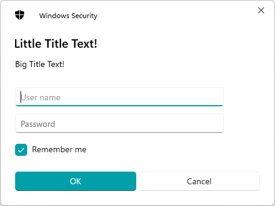

IROX-SAFE-WINDOWS
=====================

*Wrappers around the windows native unsafe functions to make them ergonomic*


### Credentials Cache
* Prompt for a username & password:
```rust
use irox_safe_windows::credentials::{Credentials, PromptOptions, prompt};
use irox_safe_windows::error::Error;

pub fn main() -> Result<(), Error> {
    let options = PromptOptions::new()
        .with_title("Little Title Text!")
        .with_subtitle("Big Title Text!");
    let creds : Credentials = prompt(&options)?;
    let username : &String = &creds.username;
    let password : &String = &creds.password;
    let user_requested_save : &bool = &creds.save_requested;
    Ok(())
}
```
